# playwright-markdown-timeline-reporter

[](LICENSE.md)

The playwright-markdown-timeline-reporter is a powerful library designed to convert Playwright test results into visually intuitive Markdown Gantt charts. It transforms test progression and dependencies into easy-to-read graphical timelines, thus promoting more effective analysis and understanding.

## Features

- **Markdown Gantt chart generation**: The library processes Playwright test results to create Gantt charts in Markdown format. Each test case is represented by a bar on the timeline, indicating its commencement and completion times. Additionally, dependencies between test cases are illustrated via interconnected lines, making the test flow clearer.

## Usage

1. Install the playwright-markdown-timeline-reporter library:

```shell
npm i -D playwright-markdown-timeline-reporter
```

2. To use a reporter define it in playwright.config.ts as reporter:

- playwright.config.ts
```typescript
import { defineConfig, devices } from '@playwright/test';

export default defineConfig({
  reporter: [
    [ 'playwright-markdown-timeline-reporter', { outputFile: 'timeline.md', header:'## Timeline', footer:'footer comment' } ]
  ],
})
```

## Options

| Option           | Required | Description                                                     |
|------------------|----------|-----------------------------------------------------------------|
| outputFile       | Optional | Specifies the output file. If omitted, results are output to standard out. |
| header           | Optional | Adds a custom message at the beginning of the output content.   |
| footer           | Optional | Adds a custom message at the end of the output content.         |
| workerGraphWidth | Optional | Specifies the width of the parallel graph. The default value is 600.|

### Output Example

```vega-lite
{
  "$schema": "https://vega.github.io/schema/vega-lite/v4.json",
  "description": "A simple line chart with embedded data.",
  "width": 600,
  "data": {
    "values": [
      {
        "time": "1969-12-31T15:00:00.000Z",
        "count": 2
      },
      {
        "time": "1969-12-31T15:00:33.238Z",
        "count": 1
      },
      {
        "time": "1969-12-31T15:00:35.185Z",
        "count": 0
      },
      {
        "time": "1969-12-31T15:00:36.070Z",
        "count": 1
      },
      {
        "time": "1969-12-31T15:00:37.918Z",
        "count": 2
      },
      {
        "time": "1969-12-31T15:01:10.626Z",
        "count": 2
      },
      {
        "time": "1969-12-31T15:01:11.218Z",
        "count": 2
      },
      {
        "time": "1969-12-31T15:01:27.863Z",
        "count": 1
      },
      {
        "time": "1969-12-31T15:01:28.372Z",
        "count": 0
      },
      {
        "time": "1969-12-31T15:01:30.622Z",
        "count": 1
      },
      {
        "time": "1969-12-31T15:01:31.560Z",
        "count": 2
      },
      {
        "time": "1969-12-31T15:01:53.299Z",
        "count": 1
      },
      {
        "time": "1969-12-31T15:01:55.300Z",
        "count": 0
      }
    ]
  },
  "mark": "line",
  "encoding": {
    "x": {
      "field": "time",
      "type": "temporal",
      "title": "Time",
      "axis": {
        "format": "%H:%M:%S"
      }
    },
    "y": {
      "field": "count",
      "type": "quantitative",
      "title": "Worker Count",
      "axis": {
        "tickMinStep": 1
      }
    }
  }
}
```




```mermaid
gantt
  title [webkit] example.spec.ts

  todayMarker off
  dateFormat  HH:mm:ss
  axisFormat  %H:%M
  tickInterval 1minute

  section Run
    Example Test : milestone, 00:00:00, 0s
    has title: active, 00:00:00, 33.221s
    get started link: active, 00:00:36, 35.148s
    error test case: crit, 00:01:11, 17.151s
    skip test case: done, 00:01:31, 23.74s
    End : milestone, 00:02:00, 0s
```

## License

The playwright-markdown-timeline-reporter project is under the MIT License. For more details, refer to the [LICENSE](LICENSE.md) file.
