# playwright-markdown-timeline-reporter

[](LICENSE.md)

The playwright-markdown-timeline-reporter is a powerful library designed to convert Playwright test results into visually intuitive Markdown Gantt charts. It transforms test progression and dependencies into easy-to-read graphical timelines, thus promoting more effective analysis and understanding.

## Features

- **Markdown Gantt chart generation**: The library processes Playwright test results to create Gantt charts in Markdown format. Each test case is represented by a bar on the timeline, indicating its commencement and completion times. Additionally, dependencies between test cases are illustrated via interconnected lines, making the test flow clearer.

## Usage

1. Install the playwright-markdown-timeline-reporter library:

```shell
npm i -D playwright-markdown-timeline-reporter
```

2. To use a reporter define it in playwright.config.ts as reporter:

- playwright.config.ts
```typescript
import { defineConfig, devices } from '@playwright/test';

export default defineConfig({
  reporter: [
    [ 'playwright-markdown-timeline-reporter', { outputFile: 'timeline.md', header:'## Timeline', footer:'footer comment' } ]
  ],
})
```

## Options

| Option      | Required | Description                                                     |
|-------------|----------|-----------------------------------------------------------------|
| outputFile  | Optional | Specifies the output file. If omitted, results are output to standard out. |
| header      | Optional | Adds a custom message at the beginning of the output content.   |
| footer      | Optional | Adds a custom message at the end of the output content.         |

### Output Example

```mermaid
gantt
  title [webkit] example.spec.ts

  todayMarker off
  dateFormat  HH:mm:ss
  axisFormat  %H:%M
  tickInterval 1minute

  section Run
    test.describe : milestone, 00:00:00, 0s
    success test case1: active, 00:00:00, 31.266s
    success test case2: active, 00:00:32, 31.019s
    error test case: crit, 00:01:03, 15.619s
    skip test case: done, 00:01:19, 20.836s
    End : milestone, 00:02:00, 0s
```

```mermaid
gantt
  title [chromium] example.spec.ts

  todayMarker off
  dateFormat  HH:mm:ss
  axisFormat  %H:%M
  tickInterval 1minute

  section Run
    test.describe : milestone, 00:00:00, 0s
    success test case1: active, 00:00:00, 32.247s
    success test case2: active, 00:00:33, 30.976s
    error test case: crit, 00:01:04, 15.828s
    skip test case: done, 00:01:20, 20.976s
    End : milestone, 00:02:00, 0s
```





## License

The playwright-markdown-timeline-reporter project is under the MIT License. For more details, refer to the [LICENSE](/LICENSE.md) file.
